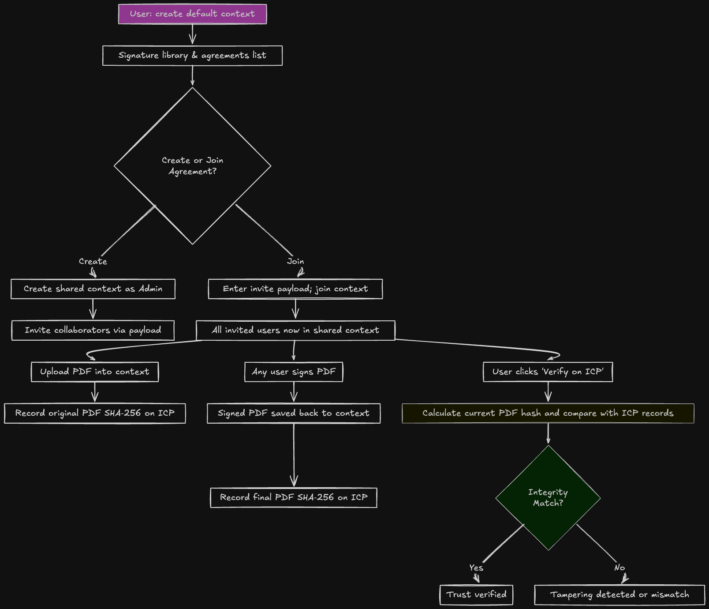

# MeroDocs

**MeroDocs** is a privacy-first e‑signature platform built on Calimero. It empowers users on independent nodes to securely collaborate, sign PDF contracts peer‑to‑peer, and publicly attest document integrity via the Internet Computer (ICP)—all without centralized servers or intermediaries.

---

## 🔧 Project Overview & Current Status

### Default Context (User’s Private Workspace)
- Each user creates a **private default context** on their node.
- This context stores:
  - The user’s **signature library**
  - A list of **agreements** (shared contexts) the user belongs to

### Creating or Joining Agreements
- **Create Agreement**: A user creates a new shared context and becomes the Admin.
- **Invite Collaborators**: The Admin generates an **invite payload** using other participants’ Calimero identity and assigns permissions (view/sign).
- **Join Agreement**: A user on a different node enters the invite payload and names the agreement on their node.

### Shared Context Workflow
- Multiple users across nodes join a **shared context**.
- Within the shared agreement:
  - Users **upload PDFs**
  - Members can **view or sign**, according to their permissions
  - Access remains restricted to invited participants—**no third parties have access**

### PDF Upload & Signing with ICP Integration
- When a PDF is uploaded to the context:
  - Its **original SHA‑256 hash** is recorded on the **ICP canister**
- After signing:
  - The **signed PDF** is saved back into the context
  - The **final document hash** is recorded on ICP
- A **“Verify on ICP”** button enables:
  - Recomputing the local PDF hash
  - Comparing it with the on-chain value
  - Confirms whether the document matches the recorded state or has been tampered with

---

## 📘 Workflow Flowchart

  

---

## 🧩 Features Overview

| Feature                        | Description                                                                 |
|---------------------------------|-----------------------------------------------------------------------------|
| Private Context                 | Local workspace per user for signature library and agreement list.           |
| Agreement Creation              | Create a shared context; you become its administrator.                       |
| Invitation System               | Generate secure invite payloads tied to Calimero identities with permissions.|
| Join Agreement                  | Input invite payload to create shared context on your node.                  |
| Collaborative PDF Workflow      | Users upload, view, and sign PDFs based on assigned roles in context.        |
| ICP Integration for Integrity   | Record original and final document hashes on the Internet Computer.          |
| Verify Document Status          | Button to compare current PDF hash with ICP-stored hashes.                   |
| End‑to‑End Privacy              | Documents are never exposed outside Calimero if not explicitly shared.        |

---

## 🛠 Technical Implementation Details

**Calimero-Based Contexts**
- User-specific default context stores local signatures and membership.
- Shared contexts are created or joined via invite payloads.
- All interactions (invite, upload, sign) use Calimero RPC and encryption.

**ICP Integration**
- SHA‑256 hashes recorded for both original and signed PDFs.
- Public verification without exposing sensitive content.

---

## 🔐 Security & Privacy Assurance

- All documents remain encrypted within Calimero contexts.
- Only hashes are stored on-chain—no files ever leave user nodes.
- Access to documents is strictly permissioned, ensuring privacy and control.

---
