# CI/CD Pipeline Setup for MeroDocs ICP Canister

This document explains how to set up and use the CI/CD pipeline for deploying your ICP canister to the mainnet.

## 🚀 Pipeline Overview

### **Deployment Triggers**

- **Automatic**: Push git tags following semver pattern (e.g., `v1.0.0`, `v2.1.3`)
- **Manual**: Using GitHub Actions "Run workflow" button

### **Release Process**

A new version is released by creating and pushing a git tag:

```bash
git tag v1.0.0
git push origin v1.0.0
```

### **Testing Strategy**

Before deployment, the pipeline:

1. ✅ Builds the Rust canister for WASM32 target
2. ✅ Verifies WASM file generation
3. ✅ Extracts and validates Candid interface
4. ✅ Runs compilation tests

## 🔧 Setup Instructions

### 1. Generate DFX Identity for CI/CD

First, create a new identity specifically for deployments:

```bash
# Create a new identity
dfx identity new ci-deployment
dfx identity use ci-deployment

# Get the principal ID (you'll need this for cycles management)
dfx identity get-principal

# Export the identity to PEM format
dfx identity export ci-deployment > ci-identity.pem
```

### 2. Configure GitHub Secrets

Go to your GitHub repository → Settings → Secrets and Variables → Actions, and add:

#### Required Secrets:

- **`DFX_IDENTITY_PEM`**: Contents of the `ci-identity.pem` file you generated

#### Optional Secrets (for future enhancements):

- **`CYCLES_WALLET_ID`**: Your cycles wallet canister ID
- **`SLACK_WEBHOOK_URL`**: For deployment notifications

### 3. Fund Your Deployment Identity

Your deployment identity needs cycles to create and manage canisters:

```bash
# Switch to your funded identity
dfx identity use default  # or your main identity

# Transfer ICP to the deployment identity
dfx ledger transfer --amount 0.5 --to $(dfx identity get-principal ci-deployment)

# Convert ICP to cycles (using deployment identity)
dfx identity use ci-deployment
dfx cycles convert --amount 0.4
```

## 📋 Usage

### Creating a Release

1. **Make your changes** and commit them to your branch
2. **Merge to main/master** branch
3. **Create and push a version tag**:
   ```bash
   git checkout master
   git pull origin master
   git tag v1.0.0  # Use semantic versioning
   git push origin v1.0.0
   ```

The pipeline will automatically:

- Build and test the canister
- Deploy to ICP mainnet
- Provide deployment URLs in the GitHub Actions summary

### Manual Deployment

You can also trigger deployments manually:

1. Go to GitHub → Actions tab
2. Select "Deploy ICP Canister" workflow
3. Click "Run workflow"
4. Choose environment and run

### Testing Before Release

Before creating a release tag, test locally:

```bash
cd merodocs_registry
./test-deployment.sh
```

This script will:

- Check prerequisites
- Build the canister locally
- Deploy to local dfx instance
- Provide testing URLs

## 📊 Pipeline Workflow

```mermaid
graph TD
    A[Push Tag v*.*.*] --> B[Build & Test Job]
    B --> C{Tests Pass?}
    C -->|Yes| D[Deploy Job]
    C -->|No| E[❌ Fail Pipeline]
    D --> F[Setup dfx Identity]
    F --> G[Deploy to ICP Mainnet]
    G --> H[✅ Success - Post URLs]

    I[Manual Trigger] --> D
```



## 🔍 Monitoring Deployments

After deployment, you can monitor your canister:

### Canister URLs:

- **Main Interface**: `https://{CANISTER_ID}.icp0.io`
- **Candid UI**: `https://a4gq6-oaaaa-aaaab-qaa4q-cai.raw.icp0.io/?id={CANISTER_ID}`

### Useful dfx Commands:

```bash
# Check canister status
dfx canister --network ic status backend

# View canister info
dfx canister --network ic info backend

# Check cycles balance
dfx canister --network ic status backend --with-cycles
```

## 🛠 Troubleshooting

### Common Issues:

**Pipeline fails with "insufficient cycles":**

- Fund your deployment identity with more ICP/cycles
- Check cycles balance: `dfx wallet --network ic balance`

**Build fails:**

- Check Rust version compatibility
- Ensure all dependencies are specified in Cargo.toml
- Test locally with `./test-deployment.sh`

**Identity issues:**

- Regenerate the identity PEM and update the secret
- Ensure the identity has sufficient cycles

### Getting Help:

1. Check the GitHub Actions logs for detailed error messages
2. Test the deployment locally first
3. Verify your dfx and Rust versions match the pipeline

## 📈 Next Steps

Consider these enhancements:

- Add automated tests for canister functionality
- Set up monitoring and alerting
- Implement staging environment
- Add rollback capabilities
- Set up automatic cycles top-up
